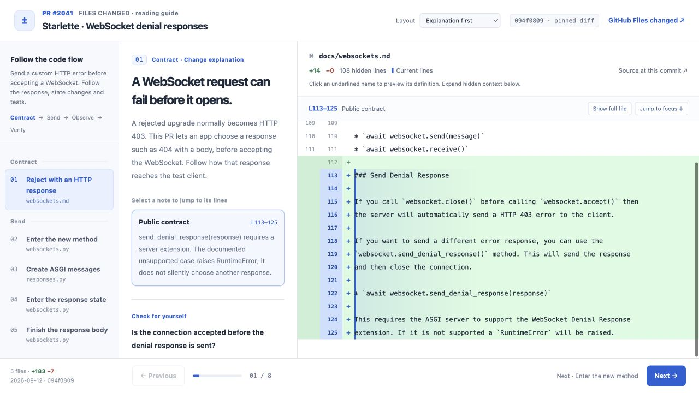
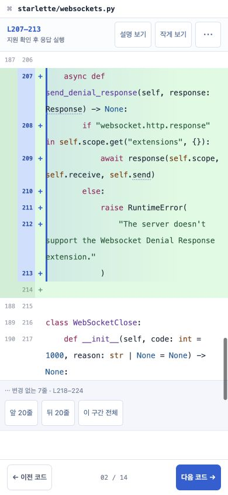
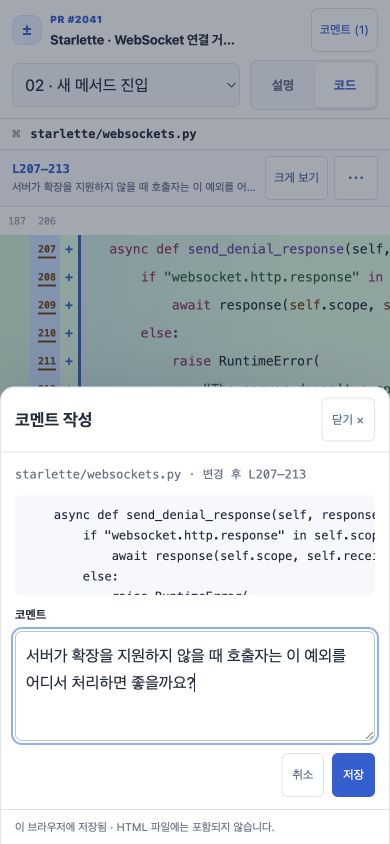

# PR Tour

**PR의 코드 흐름을 안내하는 가이드.**

[English](README.md)

GitHub PR을 독립 실행형 HTML 가이드로 만드는 에이전트 스킬입니다. 읽는 순서, 실제 diff, 설명을 한 화면에 두고 필요한 함수·타입의 정의를 바로 열어볼 수 있습니다.



## 예제 보기

[Starlette PR #2041](https://github.com/Kludex/starlette/pull/2041)의 WebSocket 연결 거절 응답을 따라갑니다.

- **[한국어 데모 바로 보기](https://yunsinlee.github.io/pr-tour/demo.ko.html)** · **[English demo](https://yunsinlee.github.io/pr-tour/demo.en.html)** — 설치 없이 브라우저에서 열어보세요.
- [한국어 HTML 다운로드](https://github.com/YunSinLee/pr-tour/raw/refs/heads/main/docs/demo.ko.html) · [English HTML 다운로드](https://github.com/YunSinLee/pr-tour/raw/refs/heads/main/docs/demo.en.html) — 저장하면 오프라인에서도 읽을 수 있습니다.
- [한국어 manifest](examples/starlette-2041.ko.json) · [English manifest](examples/starlette-2041.en.json)

변경 파일 5개, 읽기 단계 8개, 정의 미리보기 13개를 담았습니다. 두 예제는 같은 커밋을 기준으로 만들었습니다. 완성된 HTML은 서버와 인터넷 없이 읽을 수 있습니다.

## 설치

Codex, Claude Code 등 지원하는 에이전트를 선택해 설치할 수 있습니다.

```sh
npx skills add YunSinLee/pr-tour --skill pr-tour
```

Codex를 지정하려면:

```sh
npx skills add YunSinLee/pr-tour --skill pr-tour --agent codex
```

현재 설치 도구에는 Node.js 22.20 이상이 필요합니다. 스킬 실행은 Python과 Git을 사용합니다. 직접 설치하려면 `skills/pr-tour/` 폴더를 에이전트의 스킬 경로에 복사해도 됩니다. Codex의 사용자 스킬 경로는 `~/.agents/skills/`입니다.

Claude Code의 플러그인 방식으로 설치하려면:

```text
/plugin marketplace add YunSinLee/pr-tour
/plugin install pr-tour@pr-tour
```

설치 후 `/pr-tour:pr-tour`를 호출하거나 PR의 HTML 가이드를 만들어달라고 요청하세요. 이 저장소의 설치 경로와 외부 서비스가 운영하는 추천 레지스트리 등록은 별개입니다.

### 기존 설치 업데이트

skills CLI로 설치했다면 `npx skills update pr-tour`를 실행하고 기존 설치 범위를 선택하세요. 자세한 내용은 [CLI 업데이트 옵션](https://github.com/vercel-labs/skills#skills-update)을 참고하세요.

Claude Code 마켓플레이스로 설치했다면 터미널에서 실행합니다. `user` 이외의 범위에 설치했다면 원래 설치 범위를 지정하세요.

```sh
claude plugin marketplace update pr-tour
claude plugin update pr-tour@pr-tour --scope user
```

그다음 Claude Code를 다시 시작하거나 플러그인 다시 불러오기 안내를 따르세요. [플러그인 업데이트 문서](https://code.claude.com/docs/en/plugins-reference#plugin-update)에서도 확인할 수 있습니다. 수동 설치라면 설치한 `pr-tour` 스킬 폴더를 이 저장소의 최신 `skills/pr-tour/`로 교체하세요.

이미 만든 HTML에는 이전 뷰어가 그대로 들어 있습니다. 최신 기능을 적용하려면 업데이트한 스킬과 보관한 manifest로 HTML을 다시 생성하세요. 기준 커밋은 유지하고, 교체하려는 파일에만 `--overwrite`를 사용합니다. 버전별 변경 사항은 [변경 기록](CHANGELOG.md)에 있습니다.

## 사용

해당 저장소에서 Codex에 요청합니다.

```text
$pr-tour로 이 PR을 코드 흐름대로 따라 읽는 HTML 가이드를 만들어줘.
한국어로 설명하고, 함수·타입 정의와 생략 코드 펼치기를 포함해줘.
나중에 수정할 수 있도록 manifest도 남겨줘.
https://github.com/Kludex/starlette/pull/2041
```

에이전트가 실제 코드를 읽어 순서와 설명을 작성하고, 빌더가 원본을 검증해 HTML을 만듭니다. Python 스크립트에 PR 주소만 넣어서 설명까지 자동 생성하는 구조는 아닙니다.

기본적으로 스킬은 HTML과 manifest를 고유한 `/tmp/pr-tour-<suffix>/` 폴더에 함께 저장해 현재 작업 폴더에 산출물이 쌓이지 않도록 합니다. `/tmp`가 없는 환경에서는 시스템 임시 폴더를 사용합니다. 생성 후 가이드를 열고 두 파일의 링크를 전달합니다. 임시 파일은 시스템에서 정리할 수 있으니, 오래 보관하려면 원하는 저장 경로를 지정하세요. 기존 가이드를 수정할 때는 같은 경로를 재사용합니다.

예: `HTML과 manifest는 ~/Documents/pr-tours/starlette-2041/에 저장해줘.`

## 제공하는 기능

- 파일 목록 대신 코드 흐름에 따른 읽기 순서. 같은 파일을 여러 단계에서 다시 방문할 수 있습니다.
- 기본 배치는 **설명 → 코드**입니다. 상단 **화면 배치**에서 **코드 → 설명**으로 바꿀 수 있고, 브라우저 저장소를 사용할 수 있으면 선택을 기억합니다. 휴대폰과 좁은 화면에서는 **설명 / 코드** 탭으로 한 화면씩 읽으며, 탭을 바꿔도 읽던 위치를 유지합니다. 설명을 누르면 관련 코드로 이동하고, 다른 구간으로 넘어가도 현재 탭을 유지합니다.
- 모바일 코드 화면의 **다음 코드 / 이전 코드**는 단계 안의 설명 포인트부터 다음 단계까지 순서대로 이동하며 해당 줄을 보여줍니다. **크게 보기**로 코드 공간을 넓히고, **설명 보기**로 현재 설명을 확인한 뒤 설명 포인트를 누르면 큰 코드 화면으로 돌아옵니다. 줄바꿈·전체 파일·강조 줄 이동·원본 링크는 **⋯** 도구에 있습니다. 설명 화면과 데스크톱에서는 단계 단위로 이동합니다.
- 모바일의 이동 버튼과 정의 미리보기를 터치에 맞게 넓혔습니다. 휴대폰 가로 화면에서는 헤더를 줄여 코드를 읽을 공간을 확보합니다.
- 실제 추가·삭제 코드와 변경 전·후 줄 번호, 설명에 연결된 줄 강조.
- diff와 정의 미리보기에서 키워드·문자열·주석·함수명을 색상으로 구분합니다. 주요 언어의 구문 강조는 오프라인에서도 동작하며, 지원하지 않는 파일 형식은 일반 텍스트로 표시합니다.
- 생략 구간의 앞·뒤 20줄 펼치기와 전체 파일 보기.
- 선택한 함수·타입 정의 미리보기, 관련 정의 탐색, 뒤로 가기.
- 코드·설명·스타일·스크립트를 담은 HTML 한 파일.
- 한국어·영어 UI 생성. 설명문은 요청한 언어로 따로 작성합니다.

## 모바일에서 읽기

1. 읽을 단계를 고르고 설명 포인트를 누르면 해당 코드가 열립니다. **설명 / 코드** 탭은 각 화면의 읽던 위치를 유지합니다.
2. **다음 코드 / 이전 코드**로 설명 포인트를 작성된 순서대로 따라갑니다. 단계 경계도 이어서 이동하고, 파일 끝의 코드도 화면 위쪽에 보여줍니다. 하단 숫자는 코드 포인트 기준이고, 상단 선택기는 단계 기준입니다. 설명 포인트가 없는 파일 변경도 빠뜨리지 않습니다.
3. **크게 보기**로 코드 공간을 넓힙니다. **설명 보기**로 현재 설명을 확인한 뒤 해당 포인트를 누르면 큰 코드 화면으로 돌아옵니다. **작게 보기**를 누르면 상단이 다시 나타납니다.
4. **⋯**에서 줄바꿈·전체 파일 보기·강조 줄 이동·원본 링크를 이용합니다. 줄바꿈은 표시 방식만 바꿉니다. 도구 바깥을 누르거나 Escape로 닫을 수 있으며, 정의 미리보기가 열려 있으면 Escape는 미리보기부터 닫습니다.



단계 링크는 `#step-id` 형식이며 해당 단계의 첫 설명 포인트를 엽니다. 단계 안에서 포인트를 옮길 때는 브라우저 방문 기록을 추가하지 않습니다. 설명 화면과 데스크톱의 이전·다음 버튼은 단계 단위로 이동합니다.

## 코드에 코멘트 남기기

1. 상단 **코멘트**에서 **현재 코드에 코멘트**를 누르거나 코드 도구의 **코멘트 추가**를 누릅니다. 줄 번호를 바로 눌러 시작할 수도 있습니다.
2. 한 줄을 선택합니다. 같은 쪽의 다른 줄을 누르면 시작·끝 줄 사이가 선택됩니다. 변경 전과 변경 후 코드는 따로 선택하며, 모바일에서는 선택 중에 줄 번호 영역이 커집니다.
3. **메모 쓰기**에서 의견을 적고 **저장**합니다. 목록에서 수정·삭제할 수 있고, 삭제 직후에는 취소할 수 있습니다. 코드 위치를 누르면 생략된 구간도 펼쳐 해당 줄로 이동합니다.
4. **AI에 복사**로 모든 코멘트를 JSON으로 복사하거나 **JSON 다운로드**로 보관합니다. 복사 권한이 없으면 직접 선택해 복사할 수 있는 입력창이 열립니다.
5. 다른 환경에서 같은 PR·기준 커밋의 가이드를 열고 **JSON 불러오기**로 파일을 선택하거나 JSON을 붙여넣습니다. 추가·중복·충돌 개수를 확인한 뒤 **가져오기**를 누릅니다. 같은 ID의 코멘트 내용이 다르면 기본적으로 기존 메모를 유지하며, 두 내용을 비교하고 가져온 메모로 교체할 수도 있습니다.

JSON에는 PR 주소, 기준 커밋, 파일 경로, 변경 전·후 구분, 줄 범위, 선택한 코드 원문과 의견이 들어갑니다. AI 대화에 붙여넣고 어떤 의견을 검토하거나 반영할지 요청하세요. PR Tour가 AI로 전송하거나 GitHub에 댓글을 게시하지는 않습니다. 자세한 형식은 [코멘트 내보내기](skills/pr-tour/references/review-comments.md)를 참고하세요.



저장한 코멘트는 PR과 기준 커밋별로 **이 브라우저의 저장소**에 보관됩니다. HTML 파일을 수정하거나 다른 기기·브라우저로 자동 동기화하지 않습니다. 파일 주소로 열거나 앱 안에서 볼 때는 저장소가 제한될 수 있습니다. 화면의 저장 상태를 확인하고, 오래 보관하거나 다른 환경에서 이어 보려면 JSON을 다운로드해 다시 불러오세요. 저장 전 작성 중인 글은 같은 페이지를 닫지 않는 동안만 다시 열 수 있습니다.

불러올 때 PR·저장소 주소, 기준 커밋, 줄 범위와 코드 원문을 확인합니다. 다른 버전이나 잘못된 파일은 기존 메모를 변경하지 않고 거부합니다. 같은 ID·위치·내용의 코멘트는 중복으로 건너뜁니다. 파일은 서버로 전송하지 않으며, 한 번에 10 MiB·1,000개 코멘트까지 가져올 수 있습니다.

## 요구 사항과 검증 범위

생성에는 스킬을 지원하는 에이전트, Python 3.9 이상, Git, 저장소 접근 권한이 필요합니다. 권장 GitHub 작업 흐름에서는 로그인된 `gh` CLI도 사용합니다. 새 Python 문법의 토큰 분석에는 그 문법을 지원하는 인터프리터가 필요할 수 있습니다.

읽기에는 JavaScript를 지원하는 최신 브라우저만 있으면 됩니다. 앱 안의 artifact 뷰어에서도 포함된 JavaScript 실행을 허용해야 합니다.

데모는 Chromium·WebKit에서 오프라인으로 테스트하며, 좁은 세로 화면·태블릿·휴대폰 가로 화면 크기를 포함합니다. 브라우저 화면 크기를 바꾼 검증이며, 실제 기기나 Orca artifact 뷰어에서 확인한 것은 아닙니다.

빌더는 원본 코드 복원, 줄 범위, 변경 파일 포함 여부, 정의 링크 위치를 검사합니다. 설명의 의미와 심볼 연결의 정확성은 별도로 확인해야 합니다. 모든 파일이 포함돼도 모든 중요한 동작을 설명했다는 뜻은 아닙니다. 바이너리·UTF-8이 아닌 파일·서브모듈은 미리보기 제한을 표시합니다.

HTML에는 저장소 코드가 포함됩니다. 공개할 때는 공유 가능한 예제를 선택하세요. 동봉된 예제는 공개 Starlette 코드를 사용하며 출처와 라이선스를 포함합니다.

## 개발과 기여

[스킬 작업 흐름](skills/pr-tour/SKILL.md)을 확인하고 [manifest 형식](skills/pr-tour/references/manifest.md)에 따라 설명을 작성한 뒤 실행합니다.

```sh
python3 skills/pr-tour/scripts/build_guide.py \
  --repo /path/to/repository \
  --manifest /path/to/guide.json \
  --output /path/to/guide.html
```

UI 언어는 manifest의 `language`를 `ko` 또는 `en`으로 지정하거나 `--language en`으로 바꿉니다. 기존 결과물을 갱신할 때만 `--overwrite`를 사용합니다.

```sh
python3 -m unittest discover -s tests -v
python3 scripts/rebuild_examples.py
```

첫 명령은 외부 Python 패키지 없이 회귀 테스트를 실행합니다. 두 번째 명령은 고정된 공개 Starlette 커밋을 `.cache/starlette`로 가져와 예제 두 개를 재생성합니다. 이미 커밋이 있는 저장소를 사용하려면 `--repo /path/to/starlette`를 지정하세요. Starlette의 제품 테스트를 실행하는 명령은 아닙니다.

구문 강조 회귀 테스트는 Node.js 20 이상에서 별도 패키지 설치 없이 실행합니다. 가이드 생성에는 Node.js가 필요하지 않습니다.

```sh
node --test tests/test_syntax.cjs
```

두 데모의 모바일 읽기·정의 미리보기·코멘트 브라우저 회귀 테스트는 Node.js 20 이상에서 실행합니다.

```sh
npm ci
npx playwright install chromium webkit
npm run test:browser
PR_TOUR_BROWSER=webkit npm run test:browser
```

읽기 편의성, 원본 연결의 정확성, UI 번역에 대한 기여를 환영합니다. 재현 가능한 공개 예제나 작은 테스트 사례와 확인 결과를 함께 남겨주세요.

## 라이선스

스킬·빌더·뷰어·직접 작성한 설명은 [MIT](LICENSE)입니다. 예제에 포함한 Starlette 코드는 원래의 [BSD-3-Clause 라이선스](examples/STARLETTE-LICENSE.md)를 따릅니다. Starlette의 공식 추천이나 보증을 의미하지 않습니다.

동봉된 highlight.js는 [BSD-3-Clause 라이선스](skills/pr-tour/assets/vendor/highlightjs/LICENSE)를 따르며, 생성된 HTML에도 해당 고지를 포함합니다. 사용 중인 버전과 업데이트 검증 절차는 [유지관리 문서](skills/pr-tour/assets/vendor/highlightjs/README.md)에 있습니다.
